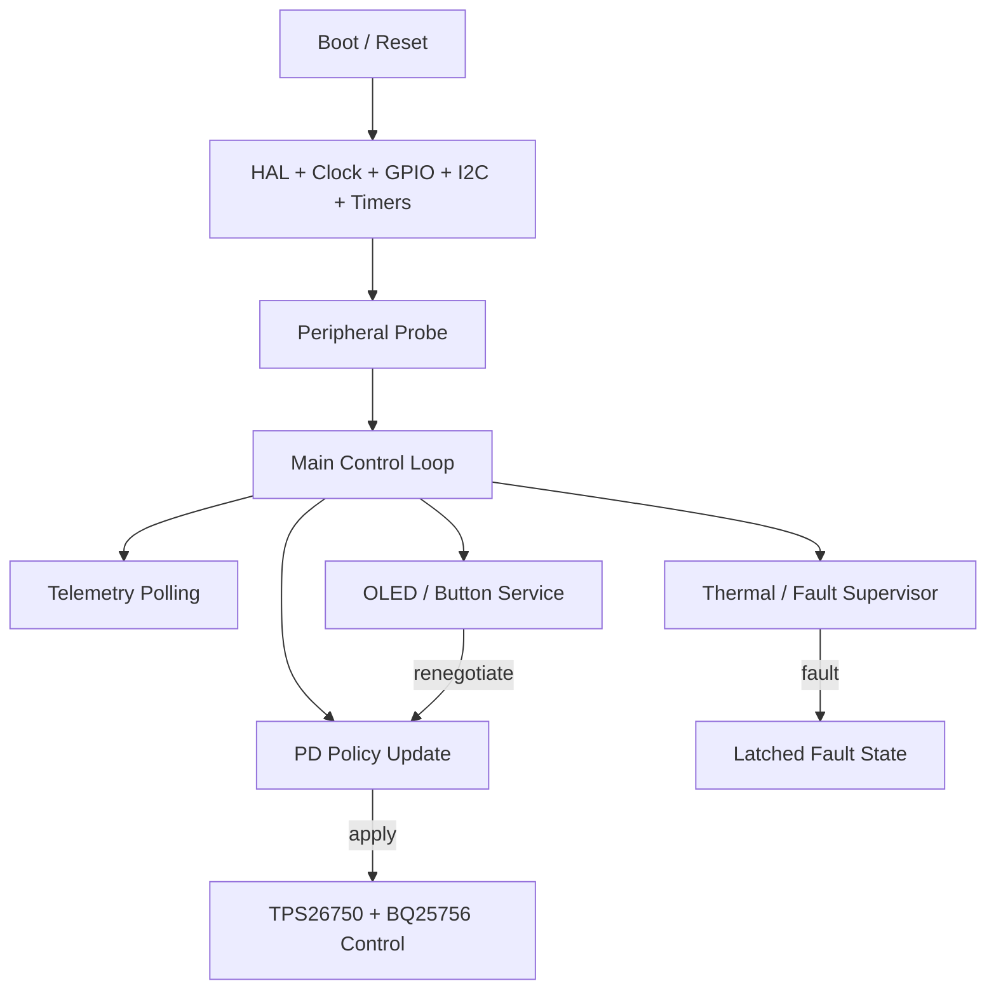
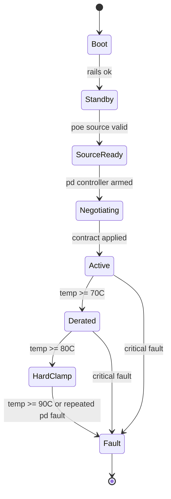

# Firmware Architecture

## Overview

The firmware controls three things:

- telemetry collection
- user interface and safety behavior
- PD source policy generation and enforcement

The MCU does **not** implement the USB Ethernet data plane. That remains within the AX88279A path.

## Module Breakdown

| Module | Responsibility |
| --- | --- |
| `main.c` | startup sequencing, scheduler loop, system heartbeat |
| `ltc9105_i2c.*` | isolated PoE telemetry readback and source classification |
| `ina228.*` | output bus voltage/current/power telemetry |
| `tmp117.*` | thermal sensor access |
| `telemetry.*` | aggregation of raw sensor data into system model |
| `pd_policy.*` | source-class and temperature aware PDO/APDO selection |
| `tps26750.*` | PD controller register access and advertised contract updates |
| `bq25756.*` | secondary bus voltage/current source configuration |
| `oled_ui.*` | page rendering and state annunciation |
| `buttons.*` | debouncing, long-press, combo detection |
| `safety.*` | derating, shutdown, and latched-fault behavior |
| `dfu_hooks.*` | DFU handoff and bootloader entry support |

## Scheduling Model

Simple cooperative scheduler in the main loop:

- `1 ms` tick: button sampling, LED heartbeat
- `10 ms` tick: UI state updates
- `100 ms` tick: thermal and output telemetry
- `250 ms` tick: PoE telemetry
- `500 ms` tick: PD policy reconciliation

This is sufficient for rev-A and keeps behavior understandable for a solo engineer.

## Control-State Model

## PD Policy Rules

### Input Classes

`pd_policy.c` normalizes the source into:

- `POE_CLASS_AF`
- `POE_CLASS_AT`
- `POE_CLASS_BT_TYPE3`
- `POE_CLASS_BT_TYPE4`
- `POE_CLASS_PASSIVE_48V`
- `POE_CLASS_UNKNOWN`

### Profiles

- `Standard`
  - higher reserve margin
  - more conservative top PDO
  - preferred default after boot
- `Pro`
  - lower reserve margin
  - allows highest safe `20V` and `28V` offers when budget permits

### Thermal Gates

- `>= 70C`: reduce max offered power by `20%`
- `>= 80C`: clamp to `30W` class equivalent
- `>= 90C`: disable source path and latch fault

### Headroom Rule

Advertised power should never exceed the lower of:

- class-based budget
- measured available secondary power estimate
- thermal derated budget

Use a default reserve factor of:

- `Standard`: `25%`
- `Pro`: `15%`

## DFU Strategy

- Main firmware contains hooks for a DFU request flag in backup/static RAM.
- Long press plus power-up may optionally set a software DFU request.
- Final DFU entry mechanism depends on bootloader integration choice during CubeMX phase.

## Coding Conventions

- Plain C with HAL, no RTOS in rev-A
- Fixed-width integer types throughout
- No floating point in control loop unless justified; prefer integer milliwatt/millivolt units
- All public headers include minimal data structures and explicit units

## Bring-Up Priorities

1. Boot and watchdog stability
2. OLED and button sanity
3. INA228 / TMP117 reads
4. LTC9105 telemetry over isolated I2C
5. Fixed 5V PD source
6. Dynamic PDO updates
7. Safety edge cases and latched-fault recovery

