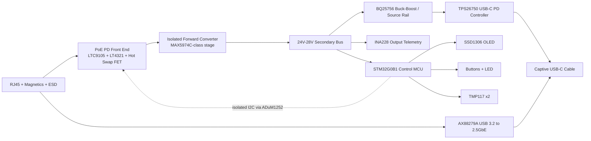

# Hardware Architecture

## Overview

The hardware is partitioned into six major domains:

1. PoE input and protection
2. Isolated primary power conversion
3. Secondary DC bus and telemetry
4. USB-C PD source path
5. USB 3.2 / 2.5GbE data path
6. Control, UI, and debug

## Architecture Decisions

### PoE Input

- Architecture target: `802.3af/at/bt` with optional advanced `48V passive`.
- Preferred controller: `LTC9105` for standards-based PD telemetry and power-priority support.
- Ideal bridge: `LT4321` to reduce dissipation relative to diode bridges.
- Input protection:
  - RJ45 TVS and common-mode choke
  - surge-capable primary layout
  - hot-swap FET with current limiting
  - explicit passive-mode interlock

### Isolation Strategy

- Isolation boundary sits between the PoE primary and all secondary logic/data/power output domains.
- MCU remains on the secondary side.
- Only telemetry/control crosses the barrier through `ADuM1252`.
- Maintain creepage and clearance targets suitable for PoE isolation and later safety review.

### Power Tree

| Rail | Nominal | Domain | Notes |
| --- | --- | --- | --- |
| `POE_VRAW` | 37V-57V | primary | post-bridge PoE input |
| `POE_VFWD` | 37V-57V | primary | hot-swap / converter feed |
| `BUS_24V` | 24V nominal | secondary | isolated bus under normal load |
| `BUS_28V` | 28V nominal | secondary | EPR-capable mode |
| `SYS_5V` | 5V | secondary | local logic and OLED supply |
| `SYS_3V3` | 3.3V | secondary | MCU, sensors, UI |
| `VBUS_SRC` | 5V-28V | output | USB-C source rail |

### Data Path

- `AX88279A` handles the Ethernet MAC/PHY to USB 3.2 bridge.
- USB data path is electrically independent of PD policy logic except for shared connector mechanics, shielding, and thermal coupling.
- Keep SuperSpeed routing isolated from noisy power stages and magnetics.

### UI And Controls

- OLED and buttons are integrated product features, not lab-only conveniences.
- Buttons must be reachable from the enclosure exterior without compromising ESD shielding.
- LED should remain visible through the polycarbonate section for quick state awareness.

## Net Naming Conventions

| Prefix | Meaning |
| --- | --- |
| `POE_` | primary-side PoE domain |
| `ISO_` | nets crossing or referenced to the isolation barrier |
| `BUS_` | isolated secondary power bus |
| `SYS_` | secondary low-voltage system rails |
| `USB_` | USB 2.0 / configuration nets |
| `SS_` | USB 3 SuperSpeed nets |
| `ETH_` | Ethernet MAC/PHY and magnetics nets |
| `PD_` | USB-PD control/status nets |
| `UI_` | OLED, buttons, LED, user interface |

## Layout Constraints

### Board Stackup

- Target stackup: `6 layers`
- Suggested use:
  - `L1`: components + critical routing
  - `L2`: solid ground
  - `L3`: high-current power routing
  - `L4`: secondary signals / control
  - `L5`: secondary ground / quiet reference
  - `L6`: components + low-speed routing

### Critical Rules

- Isolation barrier:
  - no copper encroachment under barrier slot/keepout
  - keep digital stitching and shield strategy intentional, not accidental
- USB 3.2:
  - route SuperSpeed pairs as controlled-impedance differential pairs
  - minimize via count and skew
  - keep away from transformer, hot-switch node, and inductor fringe fields
- High current:
  - heavy copper or widened pours on PoE and VBUS power paths
  - thermal vias under hot-swap FET, bridge controller, converter FETs, and buck-boost magnetics
- Thermal:
  - expose chassis-coupled pads for power-stage heat transfer
  - preserve local copper mass under major dissipation components

## Bring-Up Order

1. Verify isolated converter operation from bench supply before PoE input.
2. Validate secondary rails and MCU boot.
3. Bring up telemetry devices on isolated low-voltage side.
4. Verify isolated I2C path to PoE telemetry.
5. Bring up PD source path at fixed 5V.
6. Validate AX88279A USB enumeration and Ethernet link at 1G before 2.5G.
7. Enable dynamic PDO logic only after stable thermal and telemetry paths.

## Open Hardware Questions

- Final PoE PD controller selection versus availability and eval-board learnings
- Exact isolated converter controller and transformer design
- Whether AX88279A requires additional EEPROM/SPI flash configuration in rev-A
- Shield and chassis grounding strategy for mixed USB-C and RJ45 enclosure geometry

